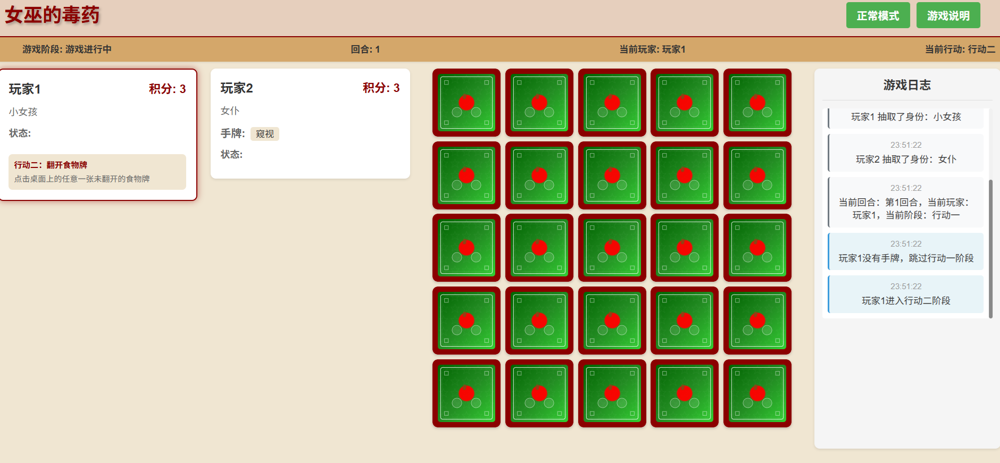
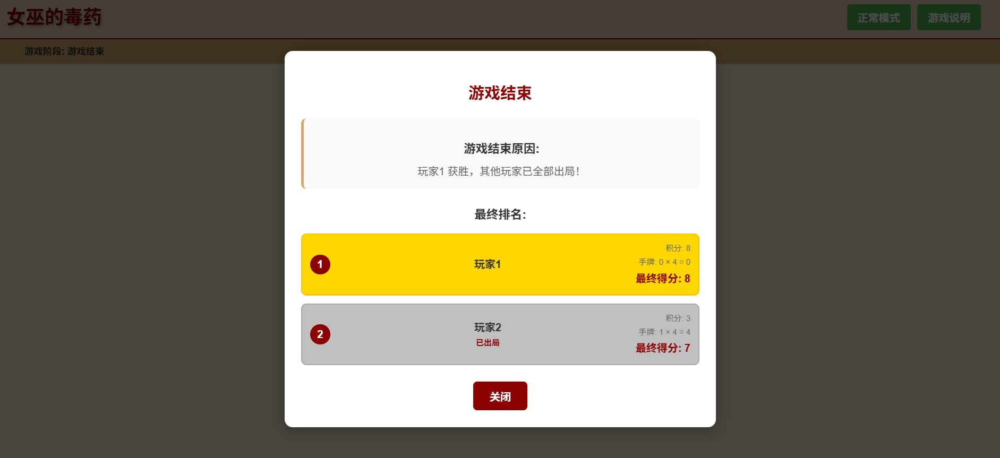

# WitchPoison

[](https://opensource.org/licenses/MIT)
[](https://vuejs.org/)
[](https://vitejs.dev/)
[](README_zh.md)

A desktop card game developed based on Vue 3 and Vite.

This project is entirely coded by [TRAE](https://www.trae.ai/) except for some text input. Special thanks to TRAE for their contribution.

"WitchPoison" is inspired by a real card game. This project is only for AI programming learning and research purposes. If there are any intellectual property issues, please contact me promptly.

Welcome to submit Issues and Pull Requests to help improve this project! Adding multilingual support might be a great idea.

## Project Introduction

"WitchPoison" is a multiplayer desktop card game. At the beginning of the game, players draw identity cards with different skills, then draw food cards each round. During the game, players can purchase tool cards with points. Players need to use strategies and skills to gain points or eliminate other players, and ultimately become the winner of the game.

## Game Features

- **Diverse Identity System**: Contains various identities, each with unique skills and effects
- **Rich Food Cards**: Multiple food cards, some provide points, others are deadly poison
- **Strategic Tools**: Various tool cards to assist yourself or interfere with other players
- **Complete Game Flow**: Full process control from identity selection to game end
- **Debug Mode**: Debugging functions for development and testing

## Technology Stack

- **Vue 3**: Frontend framework
- **Vite**: Build tool
- **JavaScript**: Programming language
- **CSS**: Style design

## Installation and Running

### Install Dependencies

```bash
pnpm install
```

### Run in Development Mode

```bash
pnpm run dev
```

### Build Production Version

```bash
pnpm run build
```

### Preview Production Build

```bash
pnpm run preview
```

## Game Rules

### Game Flow

1. **Identity Selection**: Players set the number of players and draw identity cards in turn
2. **Game Start**: Each player gets 3 initial points
3. **Round Flow**:
    - Action Phase 1: Use identity skills or tools (if any)
    - Action Phase 2: Flip a food card, some directly grant points, others have special effects
    - Action Phase 3: Can use gold to purchase tool cards, or choose not to buy

4. **Game End**: When a player draws a poison card, they are eliminated. The game ends when only one player remains or all poison cards are used up. If only poison cards remain, the player with the highest points wins. During settlement, tool cards count as 4 points each.

## Game Screenshots

### Identity Selection


### Game Progress



### Game End



### Identity Types

- **Scholar**: At the beginning of the game, gain 5 points instead of 3
- **Magician**: When using a tool card, you can look at one food card on the table
- **Girl**: You can skip your turn (once per game)
- **Little Girl**: When you purchase a tool, you only need to spend 4 points instead of 5
- **Grave Keeper**: When you flip "Witch's Poison", you are immune to elimination once, then put it back and shuffle with other food cards
- **Maid**: At the beginning of the game, gain one tool card
- **Old Rogue**: You can gain 3 points from another player (once per game)
- **Elder**: When purchasing a tool, draw two and keep one
- **Pure White Girl**: Can reshuffle all food cards (once per game)
- **Archer**: The points of the next food card are doubled (once per game)

### Food Cards

- **Witch's Poison**: Draw to be eliminated, 3 cards total
- **Apple**: Gain 1 point, 6 cards total
- **Apple Pie**: Gain 2 points, 3 cards total
- **Donut**: Gain 3 points, 2 cards total
- **Candy**: Gain 5 points, 1 card total
- **Lollipop**: Gain 3 points from other players, 2 cards total
- **Cookie**: The points of the next food card are doubled, 2 cards total
- **Magnifying Glass**: Immediately look at one food card on the field, 2 cards total
- **Magic Herb**: Immediately take one tool card, 2 cards total
- **Energy Drink**: Immediately flip another food card, 2 cards total

### Tool Cards

- **Peek**: Look at 3 food cards
- **Shape Shift**: Secretly swap positions of 2 food cards
- **Antidote**: When you flip "Witch's Poison", you are immune to elimination once, then put it back and shuffle with other food cards
- **Good Luck Dew**: Draw the top 2 cards from the tool deck, choose 1 to add to your hand, put the other back at the bottom
- **Amulet**: Cannot be eliminated until the start of your next turn
- **Strength Potion**: Choose another player, you help them flip a food card, and the effect is borne by them
- **Midas Touch**: Immediately gain 7 points
- **Skillful Steal**: Gain 3 points from another player

## Debug Mode

The game provides a debug mode for development and testing:

- View the content of all cards
- Adjust the order of tool cards
- Quickly test various game scenarios

Click the "Debug Mode" button in the game interface to toggle.

## Project Structure

```
├── public/             # Static resources
│   └── CardBack/       # Card back images
├── src/                # Source code
│   ├── components/     # Vue components
│   │   ├── Food/       # Food-related components
│   │   ├── Identity/   # Identity-related components
│   │   ├── Items/      # Item-related components
│   │   ├── Punishment/ # Punishment-related components
│   │   └── ViewPlay/   # Game main interface components
│   ├── utils/          # Utility functions and components
│   ├── App.vue         # Root component
│   ├── main.js         # Entry file
│   └── style.css       # Global styles
├── index.html          # HTML template
├── package.json        # Project configuration
└── vite.config.js      # Vite configuration
```

## License

MIT License
